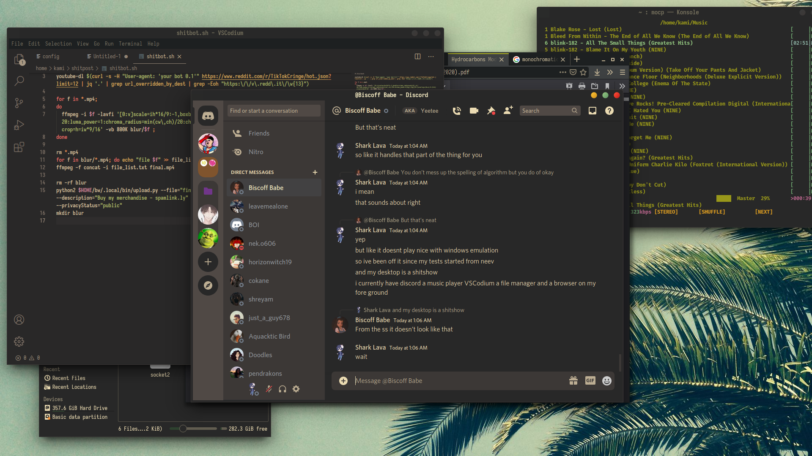
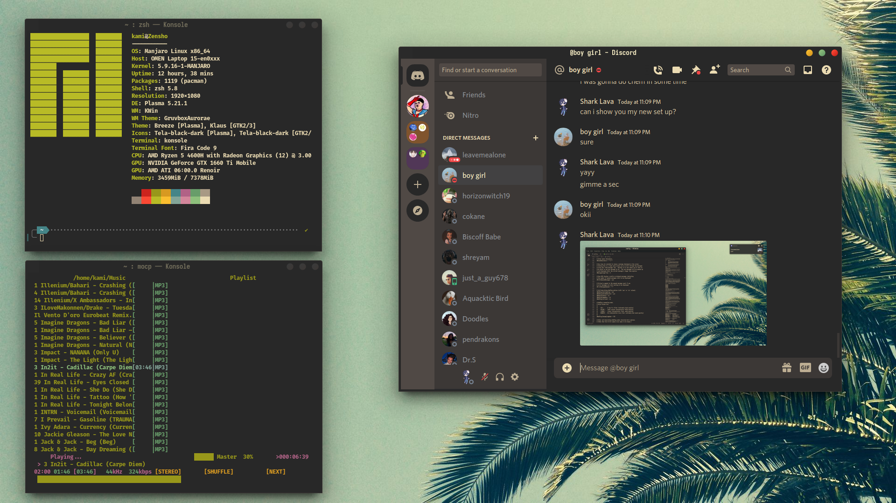
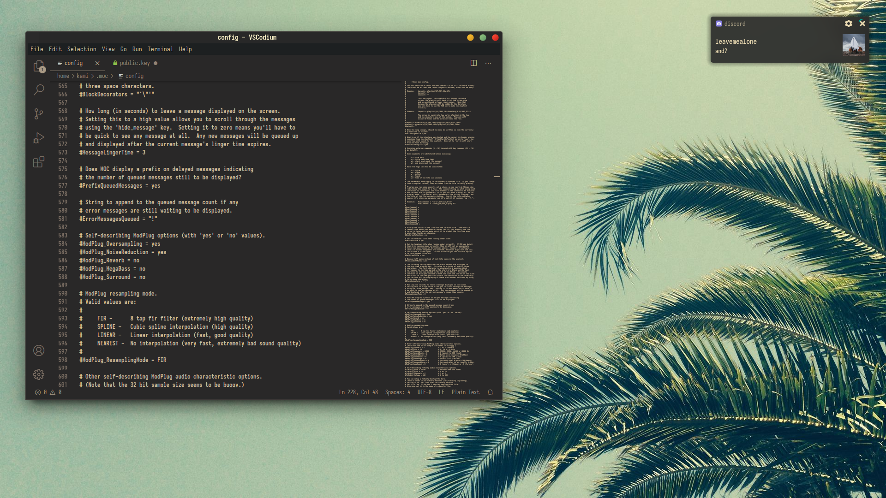
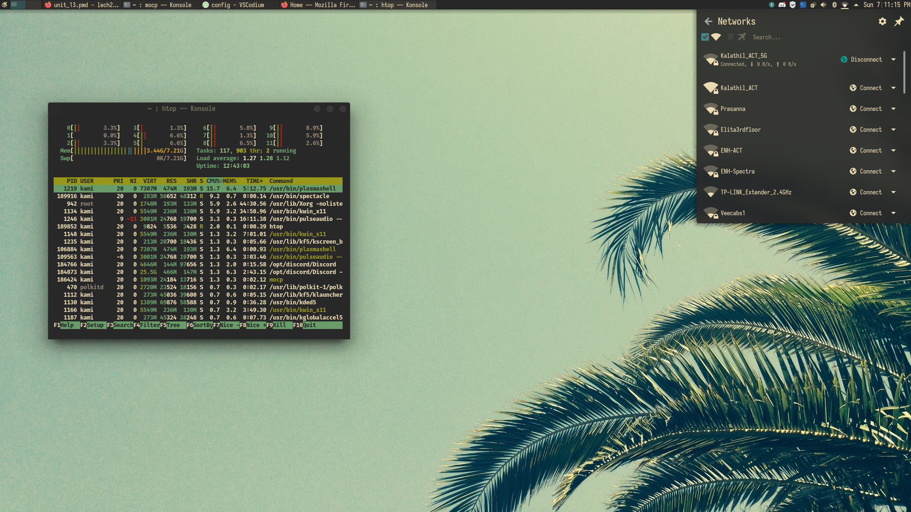

# Plasma-rice-gruvbox-rice
This is the stripped down version of a rice that I found on [r/unixporn](https://www.reddit.com/r/unixporn/).  
OP [here](https://www.reddit.com/r/unixporn/comments/lydglv/kdeplasma_easy_on_the_eyes_gruvbox_theme/) and GitHub repo [here](https://github.com/FilipeMCruz/dotfiles)

## Screenshots

## Modules

### `/curl`

[curl](https://github.com/curl/curl) config

### `/git`

Git config, with more colors and some aliases

### `/kde`

KDE global configs

### `/konsole`

[konsole](https://github.com/KDE/konsole) configs, such as profile and colorscheme

### `/nano`

Most of the syntax highlighters were "stollen" from <https://github.com/scopatz/nanorc>

### `/plasma-color-scheme`

Plasma color scheme based on gruvbox dark

### `/plasma-look-and-feel`

[splash screen](https://store.kde.org/p/1304256)

### `/plasma-theme`

Basic theme with icons taken from [here](https://store.kde.org/p/1309269)

### `/plasma-windows-decorations`

Basic decorations for windows, based heavily on [adhe' gruvbox theme](https://store.kde.org/p/1327723)

### `/vscode`

Configs related to Vscode extensions.

### `/wallpaper`

Wallpapers i'm currently using

### `/zathura`

Black and White theme
